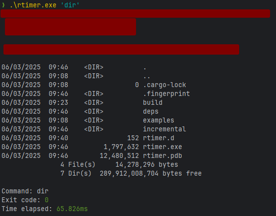

# rtimer
A CLI command timer written in Rust

## Installation
- Clone the repo
- Build the binary
- Run the program
  - Syntax: `rtimer.exe 'command'` or `./rtimer 'command'`
  - If on Linux or Mac, you will need to `chmod +x` the binary
